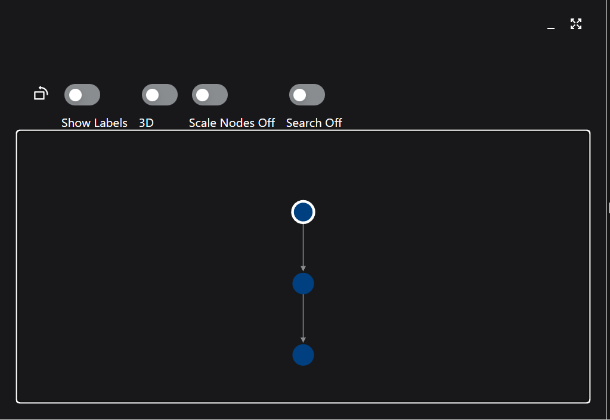
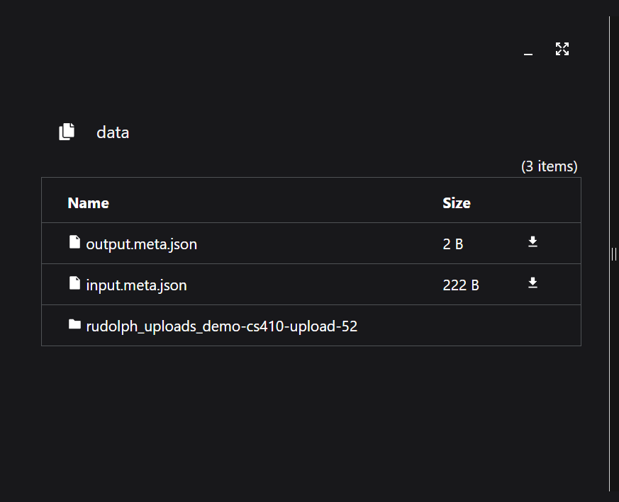
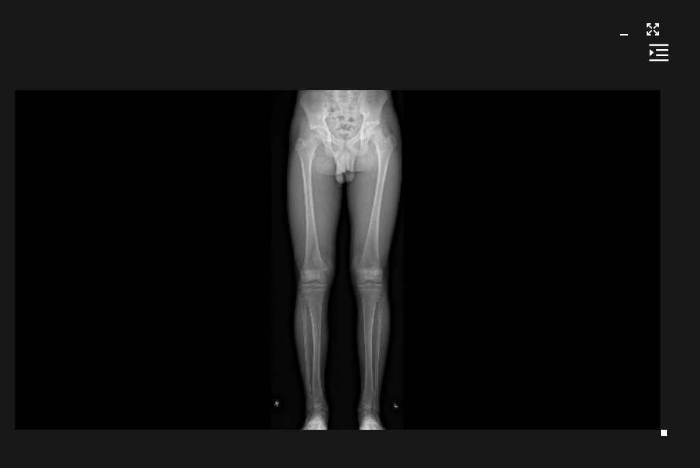
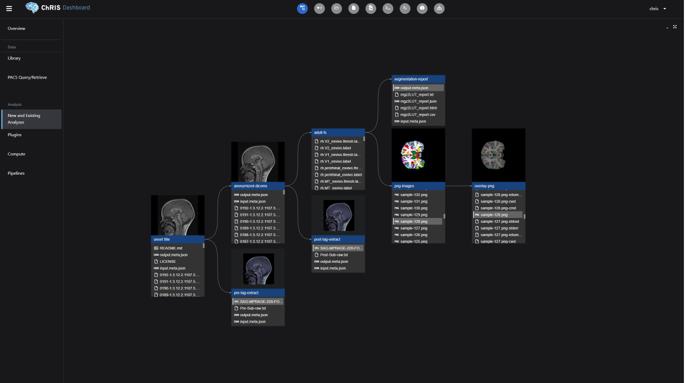

# BCH : ChRIS Node Visualization
  

Expanding the ChRIS UI to visualize better the existing multi panel display of the node's information to an integrated card display of the data.

## Description
The existing ChRIS UI shows the node tree which is a visual representation of how the data is being processed through various programs. This node tree is present in the visualization panel. The UI includes various other panels each performing and presenting different information on the selected node.

This project expands the UI and incorporates the node tree with each node represented as a card display. Each card includes information and functionality built-in which depicts what each node program is doing. 

The integrated card display of the nodes aids in simpler content delivery of the data.


## ChRIS
> [Introduction to ChRIS](http://chrisproject.org/for-users)

> [ChRIS demo](https://nightly.chrisproject.org/)
>> * Login credentials :
    Username: chris
    Password: chris1234
>> * Click “Run a Quick Workflow”
>> * Click “demo-CS410”


## Usage
Install the latest version of NodeJS.

Clone the repo

```
git clone https://github.com/IainWinter/ChRIS_ui -b PintoGideon-Integrate-Student-Workflow
```

Enter the folder

```
cd ChRIS_ui
```

Install the package in the existing node_modules directory

```
npm i
```
Only on windows

```
wsl -u root
```

run the project

```
npm run-script dev
```

Note dependencies: git, nodejs/npm,(only for windows) wsl


## Existing ChRIS UI







## The Expanded UI


## Tools and Technologies used
[React](https://react.dev/blog/2023/03/16/introducing-react-dev)

[VS Code](https://code.visualstudio.com/download)

[GitHub](https://github.com/IainWinter/ChRIS.git)


## Documentation of Related Libraries

[React D3 Trees](https://www.npmjs.com/package/react-d3-tree)

## Future Developments
* Integrate additional features to the card to present all information and perform all the functions, which are a part of the rest of the panels, such that it will help eliminate panel view of data in whole.


